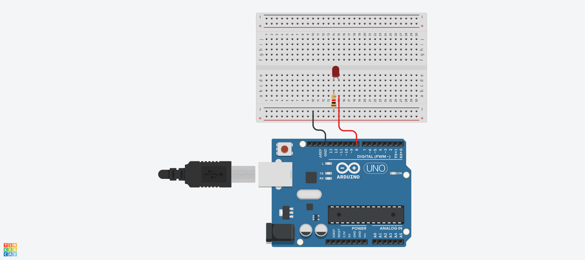
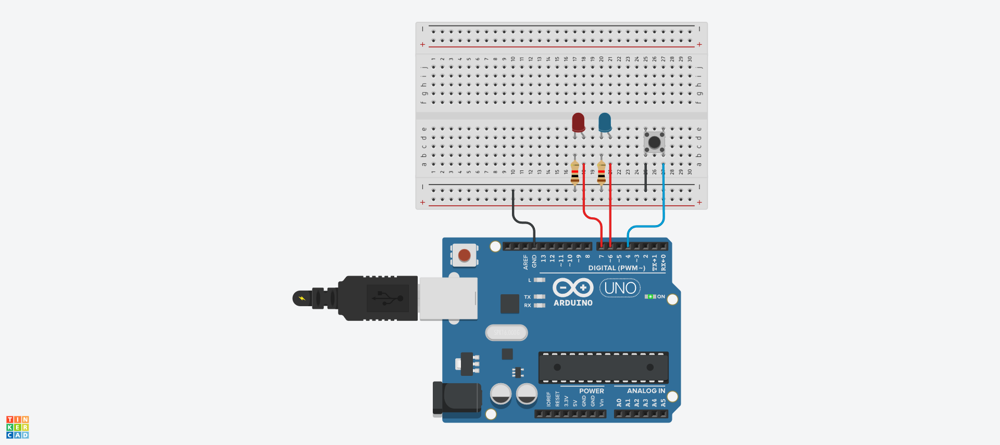

#LED 연급

## LED 깜박이기



## LED 깜박이기 Source Code 

```C
#define LED_BUILTIN 8
// the setup function runs once when you press reset or power the board
void setup() {
  // initialize digital pin LED_BUILTIN as an output.
  pinMode(LED_BUILTIN, OUTPUT);
}

// the loop function runs over and over again forever
void loop() {
  digitalWrite(LED_BUILTIN, HIGH);  // turn the LED on (HIGH is the voltage level)
  delay(1000);                      // wait for a second
  digitalWrite(LED_BUILTIN, LOW);   // turn the LED off by making the voltage LOW
  delay(1000);                      // wait for a second
}
```
## a와 b로 LED 켜고 끄기
```C
void setup(){
  Serial.begin(9600);
  pinMode(8, OUTPUT);
}
void loop() {
  if(Serial.available() > 0)
  {
    char sData = Serial.read();
    if(sData == 'a')
    {
      digitalWrite(8, HIGH);
    }
    else if(sData == 'b')
    {
      digitalWrite(8, LOW);
    }
  }
}
```
## 버튼으로 LED 깜박이기



```c
#define BUTTON 4
#define LED_BLUE 7
#define LED_RED 6
#define DELAY_TIME 80

int state = 0;

void setup() {
  Serial.begin(9600);
  pinMode(BUTTON, INPUT_PULLUP);
  pinMode(LED_BLUE, OUTPUT);
  pinMode(LED_RED, OUTPUT);
}

void loop() {
  int buttonValue = !digitalRead(BUTTON);
  
  if(buttonValue == 1) {
    state = !state;
    delay(500);
  }
  
  if(state == 0){
    digitalWrite(LED_BLUE, HIGH);
    digitalWrite(LED_RED, LOW);
    delay(DELAY_TIME);
    digitalWrite(LED_RED, HIGH);
    digitalWrite(LED_BLUE, LOW);
    delay(DELAY_TIME);
  }
  else if(state == 1) {
    digitalWrite(LED_BLUE, LOW);
    digitalWrite(LED_RED, LOW);
  }
}

```

